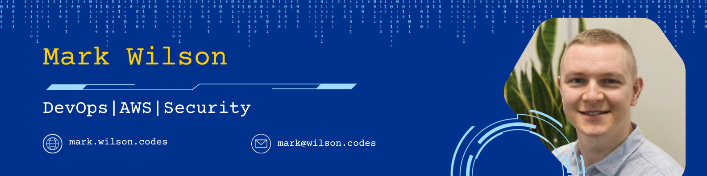

<!--  -->

# 💻🦜 Mark Wilson

I specialise in software development and have a strong background in DevOps, and Cybersecurity. With over five years of professional experience in IT, my career journey has taken me from Education to the FinTech industry.

Having recently relocated from Brisbane to Melbourne, I quickly became a part of the thriving local tech community. I currently play a co-organiser role at [K8SUG](https://au.linkedin.com/company/k8sug), contributing to the wider adoption of Kubernetes in Australia.

### Connect with me

&nbsp;
&nbsp;
&nbsp;

---

### Languages and Tools

  &nbsp;
  &nbsp;
  &nbsp;
  &nbsp;
  &nbsp;
  &nbsp;
  &nbsp;
  &nbsp;
  &nbsp;
  &nbsp;
  &nbsp;
  &nbsp;
  &nbsp;
  &nbsp;
  &nbsp;
  &nbsp;
  &nbsp;
  &nbsp;
  &nbsp;
  &nbsp;
  &nbsp;
  &nbsp;

### Currently learning... Go

 

---

### Certifications

&nbsp;
&nbsp;
&nbsp;

&nbsp;
&nbsp;
&nbsp;
&nbsp;
&nbsp;
&nbsp;

🎯 Next cloud certification goal: [AWS Certified Security - Specialty](https://aws.amazon.com/certification/certified-security-specialty/)

---

### 📊 Stats

