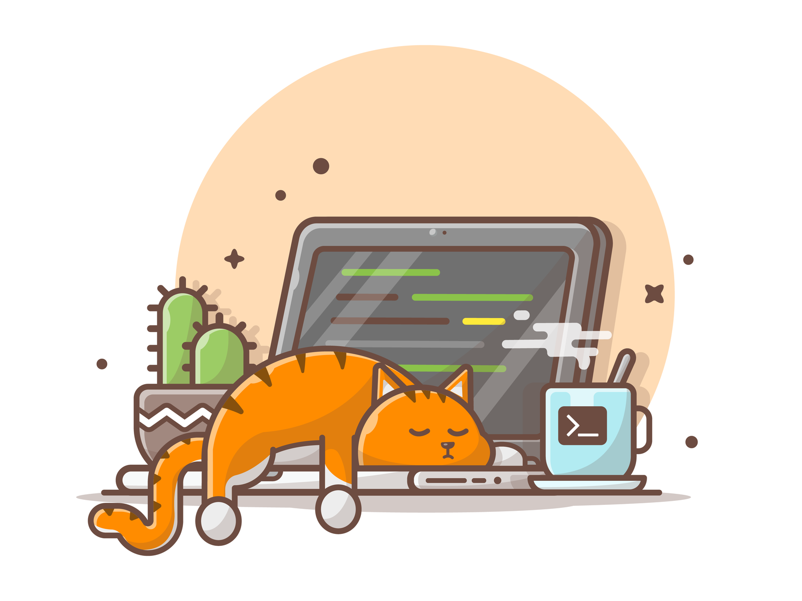
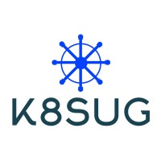
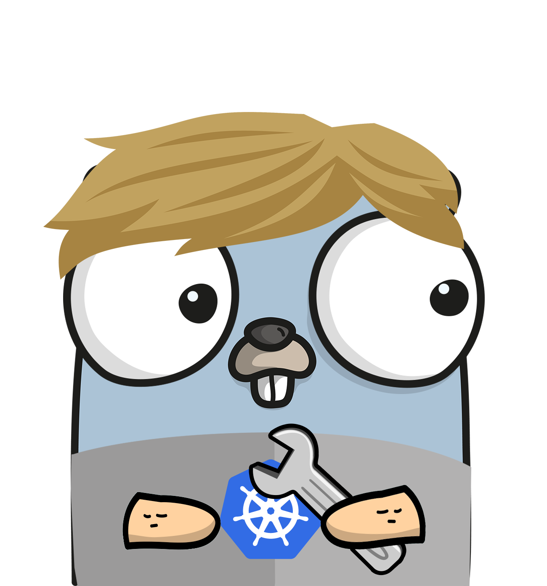

<!--  -->

# 💻🦜 Mark Wilson

I specialize in software development and have a strong background in DevOps, and Cybersecurity. Over 5+ years professional experience in IT, with my career journey taking me from Education to the FinTech industry.

I recently moved to Melbourne from Brisbane and quickly became a part of the thriving local tech community. I currently play a co-organiser role at [K8SUG](https://au.linkedin.com/company/k8sug), contributing to the wider adoption of Kubernetes in Australia.

### Connect with me

&nbsp;
&nbsp;
&nbsp;

---

### Languages and Tools

  &nbsp;
  &nbsp;
  &nbsp;
  &nbsp;
  &nbsp;
  &nbsp;
  &nbsp;
  &nbsp;
  &nbsp;
  &nbsp;
  &nbsp;
  &nbsp;
  &nbsp;
  &nbsp;
  &nbsp;
  &nbsp;
  &nbsp;
  &nbsp;
  &nbsp;
  &nbsp;
  &nbsp;
  &nbsp;

### Currently learning... Go

 

---

### Recent Certifications

🎯 Next cloud certification goal: [Certified Kubernetes Administrator (CKA)](https://training.linuxfoundation.org/certification/certified-kubernetes-administrator-cka/)

---

### 📊 Stats

